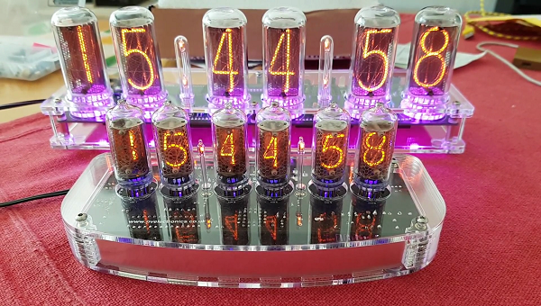

# FakeGPS
# ESP8266-NTP-timeserver for Nixie-clocks from PV Electronics
https://github.com/xSnowHeadx/FakeGPS  
README file  
SnowHead Mar 2018  

## Introduction
The company [PV Electronics](https://www.pvelectronics.co.uk) from UK sells nice Nixie-clocks:

Unfortunately these clocks have only a crystal for time accuracy and no DST-automatic. To get the exact time you can buy a [NTP-client](https://www.pvelectronics.co.uk/index.php?main_page=product_info&cPath=10&products_id=188) from the same company for $40 or you make one by yourself for $2 and with better features. 
## Function
The FakeGPS requests the UTC-Time from a NTP-Server over WiFi and Internet and generates a GPRMC-Message in the GPS-Format NMEA-0183 as required from the Clock.
Because the GPS-Time normally is UTC-time without localisation or DST-information the clock with original receiver has to be set in DST-mode manually on every DST-change. 

This converter generates a timestamp in local time considering the DST-state. So the clock can be set on a UTC-difference of 0 and don't need any configuration or switching for DST on the clock.
To calculate the correct local time it is necessary to configure the DST-rules at lines 24 and 26 in the file "fake_GPS.ino" according to your location and how described in the library [Timezone](). 

On first usage or if the module can't connect to the local WiFi-network it starts as accesspoint named "NixieAP". Connect to this AP and configure the SSID and Key of your local network as described [here](https://github.com/tzapu/WiFiManager). Then the module will connect to your network, act as NTP-server and keep the access-data for the next start.
## Hardware
* Like the original we use a [ESP8266 NodeMCU](https://www.aliexpress.com/item/1PCS-ESP8266-NodeMCU-V3-Lua-WIFI-module-memory-32M-Flash-USB-serial-CH340G/32820380705.html). 
* For the connection to the clock we only need one addtional part, a [3.5mm Stereo-plug](https://www.aliexpress.com/item/H143-3-5-pairs-of-3-5-channel-stereo-audio-plug-plug/32691597552.html) with cable like from old headphones.

The serial signal comes from Pin TXD1 (GPIO2, D4) of the NodeMCU with 9600 baud. Connect the audioplug to 5V, GND and Signal as described in the assembly instructions of the clock and configure the timereceiver of the clock for GPS-Format and 9600 Baud.

For a case there is a [minimalistic type](https://www.thingiverse.com/thing:2842012) sufficient:

 
## Software
Because the NodeMCU is Arduino-compatible it can be programmed with any IDE for Arduino. Beside the Code-file propagated here there are some Standard-Arduino-libraries an some special libraries necessary and must be imported and activated how described in the used IDE.
##### Standard libraries
* DNSServer
* Wire
##### Special libraries
* from [ESP8266-core](https://github.com/esp8266/Arduino)
	* ESP8266
	* ESP8266WebServer
	* ESP8266WiFi
* [NTPClient](https://github.com/arduino-libraries/NTPClient)
* [WiFiManager](https://github.com/tzapu/WiFiManager)
* [Time](https://github.com/PaulStoffregen/Time)
* [Timezone](https://github.com/JChristensen/Timezone)

